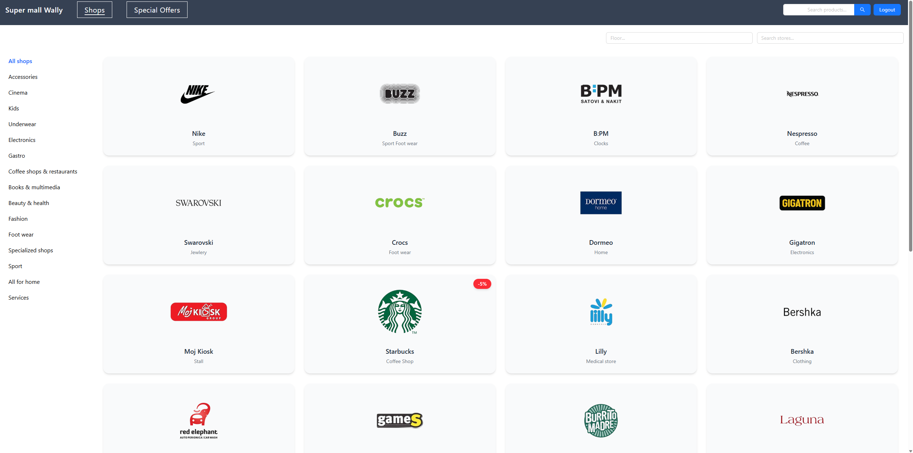
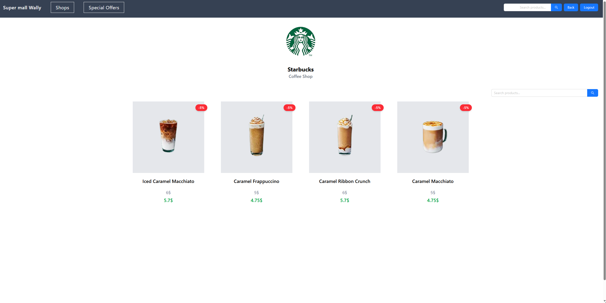
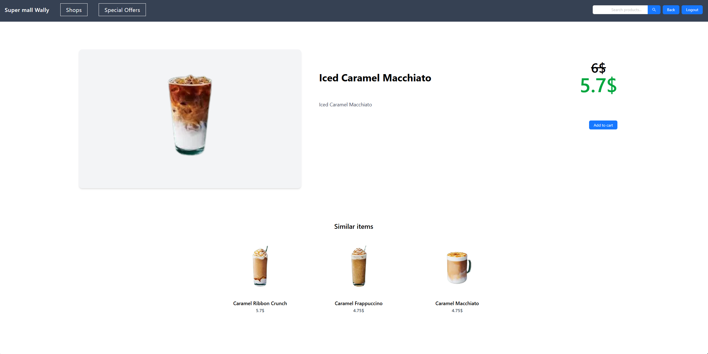

# SuperMall Frontend

A modern **React + TypeScript** frontend for an shopping mall application. Built with **Vite**, this app offers a fast, responsive UI for browsing products, managing a cart, and more.

---

## Table of Contents

- [Features](#features)  
- [Tech Stack](#tech-stack)  
- [Demo / Screenshot](#demo--screenshot)  
- [Getting Started](#getting-started)  
  - [Prerequisites](#prerequisites)  
  - [Installation](#installation)
- [Deployment](#deployment)
---

## Features

- Product listing and detail pages  
- Shopping cart functionality  
- Responsive design for mobile and desktop  
- Modular React components  
- Type-safe code with TypeScript  
- Fast development experience using Vite  

---

## Tech Stack

- **Framework**: React  
- **Language**: TypeScript  
- **Bundler / Build Tool**: Vite
- **Styling**:  Tailwind && Ant Design  
- **API**: React Query, CRUD

---

## Demo / Screenshot

### Shop Listing  
  

### Shop Detail  
  

### Article Detail 


---

## Getting Started

### Prerequisites

- Node.js (v14+ recommended)  
- npm or Yarn  

### Installation

```bash
# Clone the repository
git clone https://github.com/zvoosh/supermall-frontend.git

# Change into the directory
cd supermall-frontend

# Install dependencies
npm install
# or
yarn install
```

## Deployment
The project is hosted on Hostinger and can be viewed on domain: https://supermall.dusanprogram.eu

---
Built with ❤️ by zvoosh.